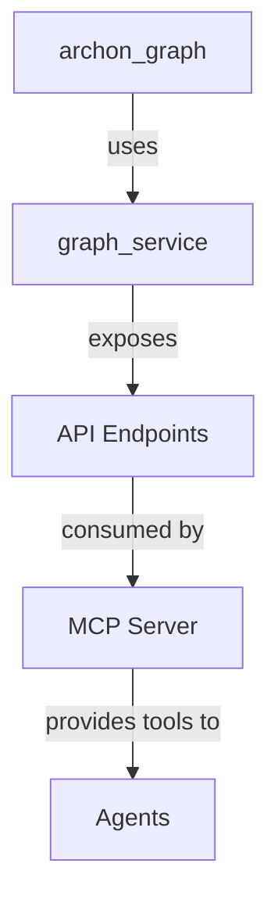

# Archon Architecture Review

## Core Components Analysis

### 1. archon_graph.py
- **Purpose**: Main LangGraph workflow implementation
- **Key Aspects**:
  - Node definitions and relationships
  - State management
  - Error handling
  - Performance characteristics

### 2. graph_service.py
- **Purpose**: FastAPI service layer
- **Key Aspects**:
  - API endpoints
  - Request/response models
  - Service integration patterns
  - Authentication/authorization

### 3. mcp_server.py
- **Purpose**: MCP server implementation
- **Key Aspects**:
  - Tool registration
  - Resource management
  - Protocol implementation
  - Security considerations

## Architectural Assessment

### Strengths

### Weaknesses
- Potential tight coupling between components
- Limited visibility into scalability bottlenecks
- Undocumented architectural decisions

### Recommendations
1. **Modularization**:
   - Clear interface definitions between components
   - Dependency injection for better testability

2. **Scalability**:
   - Horizontal scaling assessment
   - Load testing plan

3. **Documentation**:
   - Architectural decision records
   - Component interaction diagrams

## Review Process

### Phase 1: Static Analysis
- Code structure evaluation
- Dependency mapping
- Design pattern identification

### Phase 2: Dynamic Analysis
- Runtime characteristics
- Performance profiling
- Integration testing

### Phase 3: Recommendations
- Architectural improvements
- Technical debt assessment
- Migration strategies