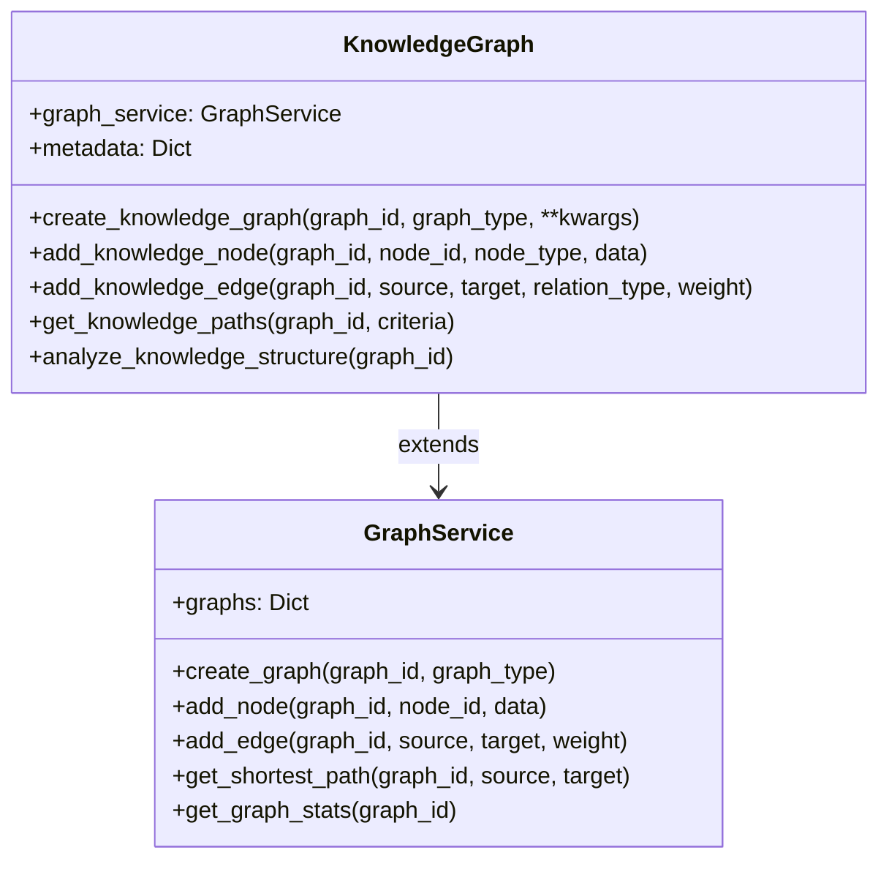

# Knowledge Graph System Documentation

## Overview
The Knowledge Graph system provides graph processing capabilities through two main components:
1. `GraphService` - Core graph operations and algorithms
2. `KnowledgeGraph` - Domain-specific graph extensions for knowledge applications



## GraphService API Reference
(Same as before, unchanged)

## KnowledgeGraph API Reference

### `create_knowledge_graph(graph_id: str, graph_type: str, **kwargs) → Dict`
Creates a specialized knowledge graph.

**Parameters:**
- `graph_id`: Unique graph identifier
- `graph_type`: 'hierarchical' or 'temporal'
- `**kwargs`: Additional graph properties

**Example:**
```python
graph = kg.create_knowledge_graph(
    "hierarchy1", 
    "hierarchical",
    description="Organization structure",
    version="1.0"
)
```

### `add_knowledge_node(graph_id: str, node_id: str, node_type: str, data: Optional[Dict] = None) → None`
Adds a typed knowledge node.

**Parameters:**
- `node_type`: Domain-specific node classification
- `data`: Extended node attributes

### `analyze_knowledge_structure(graph_id: str) → Dict`
Performs domain-specific graph analysis.

**Example Response:**
```json
{
    "node_count": 10,
    "edge_count": 15,
    "density": 0.33,
    "node_type_distribution": {
        "entity": 5,
        "event": 3,
        "relation": 2
    },
    "unique_relation_types": ["parent_of", "related_to"]
}
```

## Security Implementation
(Remains unchanged)

## Technology Stack
(Remains unchanged)

## pgvector Integration
(Remains unchanged)

## Example Workflow

```mermaid
sequenceDiagram
    participant Client
    participant KnowledgeGraph
    participant GraphService
    participant pgvector

    Client->>KnowledgeGraph: create_knowledge_graph()
    KnowledgeGraph->>GraphService: create_graph()
    GraphService-->>KnowledgeGraph: graph
    KnowledgeGraph->>pgvector: store embedding
    Client->>KnowledgeGraph: add_knowledge_node()
    KnowledgeGraph->>GraphService: add_node()
    Client->>KnowledgeGraph: analyze_knowledge_structure()
    KnowledgeGraph->>GraphService: get_graph_stats()
    GraphService-->>KnowledgeGraph: stats
    KnowledgeGraph-->>Client: analysis