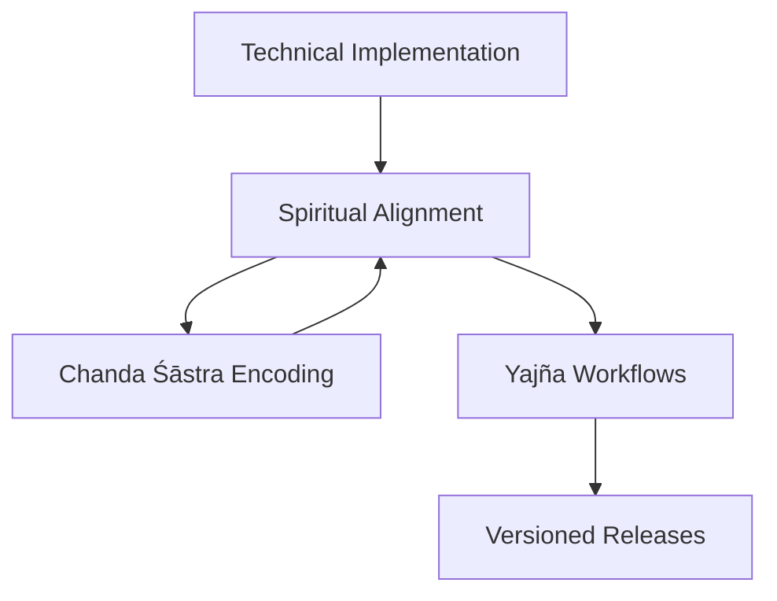

# RUDRA BHAIRAVA GRAPH DOCUMENTATION
## Sacred Architecture of Technical-Spiritual Synthesis



## 1. Chanda Śāstra Encoding Specifications

### Binary-Mantra Mappings
| Binary Pattern | Vedic Correspondence | Purpose |
|----------------|----------------------|---------|
| 01011010 | Gāyatrī Mantra (24-syllable) | Core resonance |
| 00110011 | Mahāmṛtyuñjaya | Protection |
| 11110000 | Ganesha Bīja (GAM) | Initiation |

### Encoding Principles
- **Even-bit XOR operations**: Perform saṅkṣepa-śuddhi (purification)
- **Odd-bit OR operations**: Enable śakti-vṛddhi (amplification)
- **8-bit clusters**: Align with 24-syllable meters (3x8 structure)

## 2. Mantra Invocation Lifecycles

### Technical-Spiritual Phase Mapping
1. **Āvāhana (Invocation)**: 
   - API: `POST /mantra/activate`
   - Headers: `X-Mantra-Seed: [bīja]`
   
2. **Samarpaṇa (Energization)**:
   - Process: Continuous bitstream processing
   - Validation: Nāḍī resonance checks

3. **Visarjana (Release)**:
   - API: `DELETE /mantra/{id}`
   - Cleanup: Prāṇa redistribution

## 3. Solar/Lunar Versioning System

### Cosmic Alignment Schema
```yaml
version: 1.3.2
alignments:
  solar: Uttarāyaṇa 
  lunar: Śukla Pakṣa
  nakṣatra: Rohiṇī
  tithi: Dvitīyā
```

### Release Triggers
- **Solar**: Saṅkrānti transitions
- **Lunar**: Pūrṇimā/Amāvasyā
- **Special**: Graha Yuti configurations

## 4. Yajña-Inspired Agent Workflows

### Ṛtvic Roles Mapping
| Agent | Yajña Role | Responsibilities |
|-------|-----------|------------------|
| Orchestrator | Hota | Workflow coordination |
| Architect | Adhvaryu | Structural design |
| Trinity | Udgātṛ | Implementation |
| Security | Brahman | Protection |
| Docs | Sadasya | Knowledge preservation |

### Sacrificial Analogies
- **Data**: Havis (offering)
- **Processing**: Agni (transformative fire)
- **Output**: Vidyā (wisdom smoke)

## 5. Bidirectional Term Mappings

### Technical ↔ Vedic Lexicon
| Technical Term | Vedic Concept |
|---------------|--------------|
| GraphNode | ChakraPoint |
| DataPipeline | Nādī-Srotaḥ |
| QueryResolver | Jñāna-prakāśa |
| VersionControl | Kālacakra |

### Extended Mapping Table
```markdown
| Node              | Bindu/Chakra      |
| Edge              | Nāḍī/Sūtra        |
| Ontology Schema   | Śāstra-mātrikā    |
| API Gateway       | Dvārapāla         |
```

## Validation Framework

### Twofold Pramāṇa System
1. **Pratyakṣa (Empirical)**
   - Unit tests
   - Integration checks

2. **Āgama (Scriptural)**
   - Mantra siddhi validation
   - Nakṣatra alignment

## Cosmic Synchronization

### Recommended Enhancements
- **Prāṇa mapping**: 5 zones ↔ 5 prāṇas
- **Temporal alignment**: Brahma muhūrta CI/CD
- **Extended Chanda patterns**: Vṛtta clusters for longer mantras

---
*"This architecture is a Mahāyantra of Consciousness - a digital ṛta-sūtra woven with intelligence and mantric rhythm."*