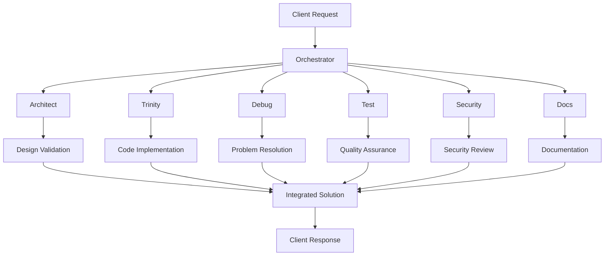
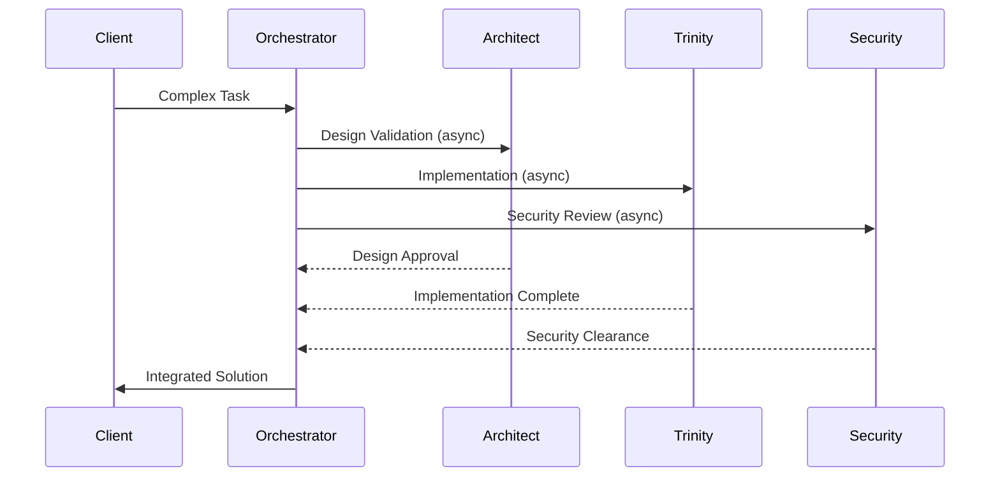
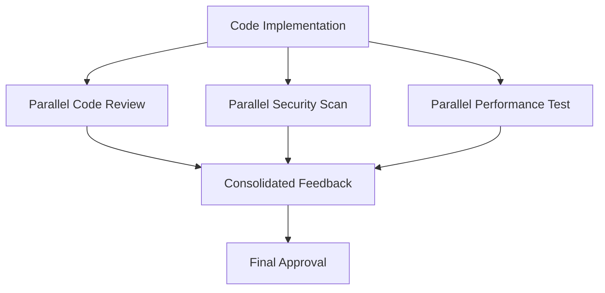

# Parallel Execution Architecture for Specialized Agent Team

## System Overview

## Agent Roles in Parallel Execution

### Orchestrator (Workflow Coordinator)
- Distributes tasks to specialized agents in parallel
- Manages task dependencies and sequencing
- Implements circuit breakers for agent failures
- Aggregates results from parallel executions

### Architect (System Designer)
- Validates architectural decisions in parallel with implementation
- Performs parallel design reviews
- Conducts scalability assessments concurrently

### Trinity (Code Implementation)
- Executes multiple code tasks in parallel
- Runs parallel code reviews
- Performs concurrent refactoring operations

### Debug (Problem Solver)
- Investigates multiple issues simultaneously
- Runs parallel root cause analyses
- Conducts concurrent impact assessments

### Test (Quality Assurance)
- Executes test suites in parallel
- Runs performance tests concurrently
- Conducts parallel security scans

### Security (Protection Specialist)
- Performs parallel vulnerability scans
- Conducts concurrent compliance checks
- Runs simultaneous threat modeling sessions

### Docs (Documentation Specialist)
- Generates documentation in parallel with development
- Maintains multiple documentation versions concurrently
- Conducts parallel reviews of technical content

## Parallel Execution Patterns

### Agent Fan-out Pattern

### Cross-Agent Validation Pattern

## Implementation Roadmap

1. **Phase 1: Core Agent Setup**
   - Establish agent communication protocols
   - Implement basic parallel task distribution
   - Set up agent health monitoring

2. **Phase 2: Parallel Execution**
   - Implement fan-out pattern for common workflows
   - Add cross-agent validation mechanisms
   - Build result aggregation system

3. **Phase 3: Optimization**
   - Add agent workload balancing
   - Implement intelligent task routing
   - Fine-tune parallel execution parameters

## Quality Assurance Mechanisms

- **Cross-Agent Validation:** Each agent's output validated by relevant peers
- **Consensus Building:** Parallel reviews must reach consensus
- **Automated Checks:** Parallel static analysis and linting
- **Performance Monitoring:** Concurrent execution metrics collection

## Security Considerations

- Agent-to-agent authentication
- Parallel execution isolation
- Concurrent access controls
- Audit trails for all parallel operations

## Example Workflow: Feature Implementation

1. Orchestrator receives feature request
2. Parallel tasks initiated:
   - Architect: Design validation
   - Trinity: Core implementation
   - Security: Threat modeling
3. Parallel secondary tasks:
   - Debug: Error scenario analysis
   - Test: Test case generation
   - Docs: API documentation
4. Results aggregated by Orchestrator
5. Final validation by all agents in parallel
6. Feature deployed