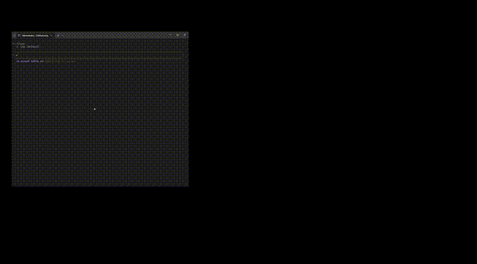

<div align="center">


# Stealth Browser MCP

**Undetectable browser automation for MCP-compatible AI agents.**

Bypass Cloudflare, antibot systems, and social media blocks with real browser instances powered by [nodriver](https://github.com/ultrafunkamsterdam/nodriver) + Chrome DevTools Protocol + [FastMCP](https://github.com/jlowin/fastmcp).

[](https://modelcontextprotocol.io)
[](https://github.com/vibheksoni/stealth-browser-mcp/stargazers)
[](LICENSE)
[](https://discord.gg/secrets)
[](CONTRIBUTING.md)

</div>

---

## Table of Contents

- [Demo](#demo)
- [Features](#features)
- [Quickstart](#quickstart)
- [Modular Architecture](#modular-architecture)
- [Toolbox](#toolbox)
- [Stealth vs Playwright MCP](#stealth-vs-playwright-mcp)
- [Troubleshooting](#troubleshooting)
- [Examples](#examples)
- [Showcase](#showcase)
- [Roadmap](#roadmap)
- [Contributing](#contributing)
- [Support](#support)
- [License](#license)

---

## Demo

<div align="center">

<br><br>
<a href="media/Showcase%20Stealth%20Browser%20Mcp.mp4" download>
  
</a>
</div>

*Stealth Browser MCP bypassing Cloudflare, cloning UI elements, and intercepting network traffic — all through AI chat commands.*

---

## Features

- **Antibot bypass** — Works on Cloudflare, Queue-It, and other protection systems that block traditional automation
- **90 tools across 11 sections** — From basic navigation to advanced CDP function execution
- **Modular loading** — Run the full 90-tool arsenal or a minimal 22-tool core; disable what you don't need
- **Pixel-accurate element cloning** — Extract complete elements with all CSS, DOM structure, events, and assets via CDP
- **Network interception** — Inspect every request, response, header, and payload through your AI agent
- **Dynamic hook system** — AI-generated Python functions that intercept and modify network traffic in real-time
- **Instant text input** — Paste large content via CDP or type with human-like keystrokes and newline support
- **Cross-platform** — Windows, macOS, Linux, Docker, and CI/CD pipelines with automatic environment detection
- **Browser support** — Chrome, Chromium, and Microsoft Edge (automatic detection)
- **Clean MCP integration** — No custom brokers or wrappers; works with Claude Code, Claude Desktop, Cursor, and any MCP client

---

## Quickstart

### 1. Clone and install

```bash
git clone https://github.com/vibheksoni/stealth-browser-mcp.git
cd stealth-browser-mcp
python -m venv venv

# Activate virtual environment
# Windows:
venv\Scripts\activate
# Mac/Linux:
source venv/bin/activate

pip install -r requirements.txt
```

### 2. Add to your MCP client

**Claude Code CLI (recommended):**

Windows:
```bash
claude mcp add-json stealth-browser-mcp "{\"type\":\"stdio\",\"command\":\"C:\\path\\to\\stealth-browser-mcp\\venv\\Scripts\\python.exe\",\"args\":[\"C:\\path\\to\\stealth-browser-mcp\\src\\server.py\"]}"
```

Mac/Linux:
```bash
claude mcp add-json stealth-browser-mcp '{
  "type": "stdio",
  "command": "/path/to/stealth-browser-mcp/venv/bin/python",
  "args": ["/path/to/stealth-browser-mcp/src/server.py"]
}'
```

> Replace `/path/to/stealth-browser-mcp/` with your actual project path.

<details>
<summary><strong>Manual JSON configuration (Claude Desktop, Cursor, etc.)</strong></summary>

Windows (`%APPDATA%\Claude\claude_desktop_config.json`):
```json
{
  "mcpServers": {
    "stealth-browser-mcp": {
      "command": "C:\\path\\to\\stealth-browser-mcp\\venv\\Scripts\\python.exe",
      "args": ["C:\\path\\to\\stealth-browser-mcp\\src\\server.py"],
      "env": {}
    }
  }
}
```

Mac/Linux (`~/Library/Application Support/Claude/claude_desktop_config.json`):
```json
{
  "mcpServers": {
    "stealth-browser-mcp": {
      "command": "/path/to/stealth-browser-mcp/venv/bin/python",
      "args": ["/path/to/stealth-browser-mcp/src/server.py"],
      "env": {}
    }
  }
}
```

</details>

<details>
<summary><strong>FastMCP CLI (untested)</strong></summary>

```bash
pip install fastmcp
fastmcp install claude-desktop src/server.py --with-requirements requirements.txt
# OR
fastmcp install claude-code src/server.py --with-requirements requirements.txt
# OR
fastmcp install cursor src/server.py --with-requirements requirements.txt
```

</details>

### 3. Test it

Restart your MCP client and ask your agent:

> "Use stealth-browser to navigate to https://example.com and take a screenshot."

---

## Modular Architecture

Choose exactly what functionality you need. Run the full 90-tool suite or strip it down to 22 core tools.

| Mode | Tools | Use Case |
|------|-------|----------|
| **Full** (default) | 90 | Complete browser automation and debugging |
| **Minimal** (`--minimal`) | 22 | Core browser automation only |
| **Custom** (`--disable-*`) | Your choice | Disable specific sections |

```bash
python src/server.py --minimal
python src/server.py --disable-cdp-functions --disable-dynamic-hooks
python src/server.py --list-sections
```

**Available sections:**

| Section | Tools | Description |
|---------|-------|-------------|
| `browser-management` | 11 | Core browser operations |
| `element-interaction` | 11 | Page interaction and manipulation |
| `element-extraction` | 9 | Element cloning and extraction |
| `file-extraction` | 9 | File-based extraction tools |
| `network-debugging` | 5 | Network monitoring and interception |
| `cdp-functions` | 13 | Chrome DevTools Protocol execution |
| `progressive-cloning` | 10 | Advanced element cloning |
| `cookies-storage` | 3 | Cookie and storage management |
| `tabs` | 5 | Tab management |
| `debugging` | 6 | Debug and system tools |
| `dynamic-hooks` | 10 | AI-powered network hooks |

---

## Toolbox

<details>
<summary><strong>Browser Management</strong></summary>

| Tool | Description |
|------|-------------|
| `spawn_browser()` | Create undetectable browser instance |
| `navigate()` | Navigate to URLs |
| `close_instance()` | Clean shutdown of browser |
| `list_instances()` | Manage multiple sessions |
| `get_instance_state()` | Full browser state information |
| `go_back()` | Navigate back in history |
| `go_forward()` | Navigate forward in history |
| `reload_page()` | Reload current page |
| `hot_reload()` | Reload modules without restart |
| `reload_status()` | Check module reload status |

</details>

<details>
<summary><strong>Element Interaction</strong></summary>

| Tool | Description |
|------|-------------|
| `query_elements()` | Find elements by CSS/XPath |
| `click_element()` | Natural clicking |
| `type_text()` | Human-like typing with newline support |
| `paste_text()` | Instant text pasting via CDP |
| `scroll_page()` | Natural scrolling |
| `wait_for_element()` | Smart waiting |
| `execute_script()` | Run JavaScript |
| `select_option()` | Dropdown selection |
| `get_element_state()` | Element properties |

</details>

<details>
<summary><strong>Element Extraction (CDP-accurate)</strong></summary>

| Tool | Description |
|------|-------------|
| `extract_complete_element_cdp()` | Complete CDP-based element clone |
| `clone_element_complete()` | Complete element cloning |
| `extract_complete_element_to_file()` | Save complete extraction to file |
| `extract_element_styles()` | 300+ CSS properties via CDP |
| `extract_element_styles_cdp()` | Pure CDP styles extraction |
| `extract_element_structure()` | Full DOM tree |
| `extract_element_events()` | React/Vue/framework listeners |
| `extract_element_animations()` | CSS animations/transitions |
| `extract_element_assets()` | Images, fonts, videos |
| `extract_related_files()` | Related CSS/JS files |

</details>

<details>
<summary><strong>File-Based Extraction</strong></summary>

| Tool | Description |
|------|-------------|
| `extract_element_styles_to_file()` | Save styles to file |
| `extract_element_structure_to_file()` | Save structure to file |
| `extract_element_events_to_file()` | Save events to file |
| `extract_element_animations_to_file()` | Save animations to file |
| `extract_element_assets_to_file()` | Save assets to file |
| `clone_element_to_file()` | Save complete clone to file |
| `list_clone_files()` | List saved clone files |
| `cleanup_clone_files()` | Clean up old clone files |

</details>

<details>
<summary><strong>Network Debugging and Interception</strong></summary>

| Tool | Description |
|------|-------------|
| `list_network_requests()` | List captured network requests |
| `get_request_details()` | Inspect headers and payload for a request |
| `get_response_content()` | Get response data from a request |
| `modify_headers()` | Add custom headers to requests |
| `spawn_browser(block_resources=[...])` | Block tracking scripts, ads, etc. |
| `create_dynamic_hook()` | Create Python functions to intercept/modify requests |
| `create_simple_dynamic_hook()` | Quick hook creation with presets |
| `list_dynamic_hooks()` | List active hooks with statistics |
| `get_dynamic_hook_details()` | Inspect hook source code |
| `remove_dynamic_hook()` | Remove a hook |
| `get_hook_documentation()` | Request object structure and HookAction types |
| `get_hook_examples()` | 10 detailed examples: blockers, redirects, proxies |
| `get_hook_requirements_documentation()` | Pattern matching and best practices |
| `get_hook_common_patterns()` | Ad blocking, API proxying, auth injection |
| `validate_hook_function()` | Validate hook code before deployment |

</details>

<details>
<summary><strong>CDP Function Execution</strong></summary>

| Tool | Description |
|------|-------------|
| `execute_cdp_command()` | Direct CDP commands (use snake_case) |
| `discover_global_functions()` | Find JavaScript functions |
| `discover_object_methods()` | Discover object methods (93+ methods) |
| `call_javascript_function()` | Execute any function |
| `inject_and_execute_script()` | Run custom JS code |
| `inspect_function_signature()` | Inspect function details |
| `create_persistent_function()` | Functions that survive reloads |
| `execute_function_sequence()` | Execute function sequences |
| `create_python_binding()` | Create Python-JS bindings |
| `execute_python_in_browser()` | Execute Python code via py2js |
| `get_execution_contexts()` | Get JS execution contexts |
| `list_cdp_commands()` | List available CDP commands |
| `get_function_executor_info()` | Get executor state info |

</details>

<details>
<summary><strong>Progressive Element Cloning</strong></summary>

| Tool | Description |
|------|-------------|
| `clone_element_progressive()` | Initial lightweight structure |
| `expand_styles()` | On-demand styles expansion |
| `expand_events()` | On-demand events expansion |
| `expand_children()` | Progressive children expansion |
| `expand_css_rules()` | Expand CSS rules data |
| `expand_pseudo_elements()` | Expand pseudo-elements |
| `expand_animations()` | Expand animations data |
| `list_stored_elements()` | List stored elements |
| `clear_stored_element()` | Clear specific element |
| `clear_all_elements()` | Clear all stored elements |

</details>

<details>
<summary><strong>Cookie and Storage</strong></summary>

| Tool | Description |
|------|-------------|
| `get_cookies()` | Read cookies |
| `set_cookie()` | Set cookies |
| `clear_cookies()` | Clear cookies |
| `get_instance_state()` | localStorage and sessionStorage snapshot |
| `execute_script()` | Read/modify storage via JS |

</details>

<details>
<summary><strong>Tabs</strong></summary>

| Tool | Description |
|------|-------------|
| `list_tabs()` | List open tabs |
| `new_tab()` | Create new tab |
| `switch_tab()` | Change active tab |
| `close_tab()` | Close tab |
| `get_active_tab()` | Get current tab |

</details>

<details>
<summary><strong>Page Analysis and Debugging</strong></summary>

| Tool | Description |
|------|-------------|
| `take_screenshot()` | Capture screenshots |
| `get_page_content()` | HTML and metadata |
| `get_debug_view()` | Debug info with pagination |
| `clear_debug_view()` | Clear debug logs |
| `export_debug_logs()` | Export logs (JSON/pickle/gzip) |
| `get_debug_lock_status()` | Debug lock status |
| `validate_browser_environment_tool()` | Diagnose platform issues and browser compatibility |

</details>

---

## Stealth vs Playwright MCP

| Feature | Stealth Browser MCP | Playwright MCP |
|---------|---------------------|----------------|
| Cloudflare / Queue-It | Consistently bypasses | Commonly blocked |
| Banking / Gov portals | Works | Frequently blocked |
| Social media automation | Full automation | Captchas and bans |
| UI element cloning | CDP-accurate extraction | Limited |
| Network debugging | Full request/response inspection via AI | Basic |
| API reverse engineering | Payload inspection through chat | Manual tools only |
| Dynamic hook system | AI-generated Python functions for real-time interception | Not available |
| Modular architecture | 11 sections, 22–90 tools | Fixed ~20 tools |
| Total tools | 90 (customizable) | ~20 |

Tested on: LinkedIn, Instagram, Twitter/X, Amazon, banking portals, government sites, Cloudflare-protected APIs, Nike SNKRS, Ticketmaster, Supreme.

---

## Troubleshooting

**No compatible browser found**
Install Chrome, Chromium, or Microsoft Edge. The server auto-detects the first available browser. Run `validate_browser_environment_tool()` to diagnose.

**Tools hang or return malformed JSON**
Debug output was printing to stdout, corrupting the MCP JSON-RPC protocol. This was fixed in [#8](https://github.com/vibheksoni/stealth-browser-mcp/issues/8). Pull the latest `master` branch.

**Browser crashes on Linux / Docker / CI**
Run with `--sandbox=false` or ensure your environment supports sandboxing. The server auto-detects root and container environments and adjusts accordingly.

**Too many tools cluttering the AI chat**
Use `--minimal` for 22 core tools, or selectively disable sections:
```bash
python src/server.py --disable-cdp-functions --disable-dynamic-hooks --disable-progressive-cloning
```

**Module not found errors**
Make sure you activated the virtual environment and installed dependencies:
```bash
pip install -r requirements.txt
```

---

## Examples

- **Market research** — Extract pricing and features from competitors, output a comparison table
- **UI cloning** — Recreate a pricing section with exact fonts, styles, and interactions
- **Inventory monitoring** — Watch a product page and alert when stock changes
- **API reverse engineering** — Intercept requests, map endpoints, and inspect data flow

All driven from a single AI agent conversation.

---

## Showcase

<div align="center">

</div>

**Augment Code hero clone** — A user asked Claude to clone the hero section from [augmentcode.com](https://www.augmentcode.com/). The agent spawned a stealth browser, navigated to the site, extracted the complete element via CDP (styles, structure, assets), and generated a pixel-accurate HTML recreation with responsive design and animations. The entire process took under two minutes of conversation.

[View the recreation](demo/augment-hero-recreation.html) | [Full walkthrough](demo/augment-hero-clone.md)

---

## Roadmap

See the live plan in [ROADMAP.md](ROADMAP.md). Contributions welcome.

---

## Contributing

Read [CONTRIBUTING.md](CONTRIBUTING.md) and open a PR. First-time contributors welcome.

If this project saves you time, star the repo — it helps more than you think.

---

## Support

If this tool saved you time or made you money, consider supporting development:

- [Buy me a coffee](https://buymeacoffee.com/vibheksoni)
- [Join the Discord](https://discord.gg/secrets)

---

## License

MIT — see [LICENSE](LICENSE).

---

<div align="center">

[](https://www.star-history.com/#vibheksoni/stealth-browser-mcp&Date)

</div>
