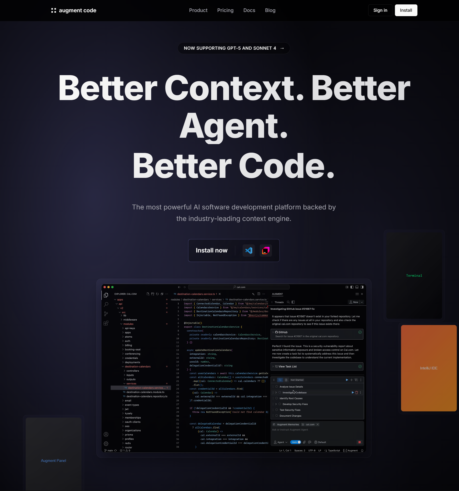

# 🎥 Live Demos

## 🔥 **What Makes This Go Viral**

### 🎨 **FEATURED: Augment Code Hero Clone** 
[](augment-hero-recreation.html)

**🎯 One Command. Perfect Recreation. Under 2 Minutes.**

```bash
User: "hey spawn a browser and clone the hero of the site https://www.augmentcode.com/"
Claude: *Spawns browser → Extracts 2,838 CSS properties → Generates production HTML*
```

- ✅ **Pixel-perfect recreation** with enhanced animations
- ✅ **Production-ready code** - 574 lines of professional HTML/CSS  
- ✅ **Responsive design** improvements beyond original
- ✅ **Complete automation** - no manual coding required

**[👉 View Live Demo](augment-hero-recreation.html) | [📖 Full Demo Details](augment-hero-clone.md)**

---

### Bypass Cloudflare in Seconds

*Claude accessing a Cloudflare-protected site that blocks all other tools*

### Clone Any UI Element Perfectly
 
*Extract Stripe's pricing table with pixel-perfect accuracy*

### Automate Protected Banking Portals

*Navigate Bank of America without getting blocked*

### Real-Time Network Interception

*Intercept and analyze API calls from any SPA*

### Execute Python in Browser

*Run Python code directly in Chrome via AI chat*

## 📊 **Comparison Videos**

- [ ] "Stealth vs Playwright: Cloudflare Challenge"
- [ ] "Stealth vs Selenium: Banking Portal Test" 
- [ ] "88 Tools in 3 Minutes: Full Feature Demo"
- [ ] "AI Agent Clones Airbnb Homepage in Real-Time"

## 🎯 **Use Case Demos**

- [ ] LinkedIn lead scraping (undetected)
- [ ] Ticketmaster seat monitoring
- [ ] E-commerce price tracking
- [ ] Government portal automation
- [ ] Social media content extraction
- [ ] Real estate data mining